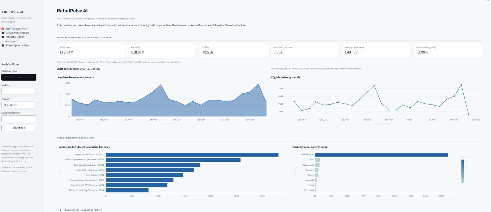
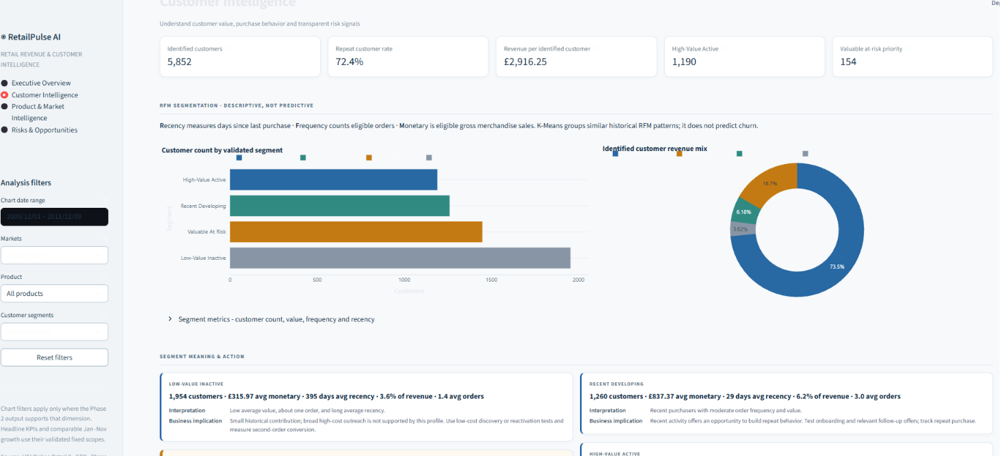
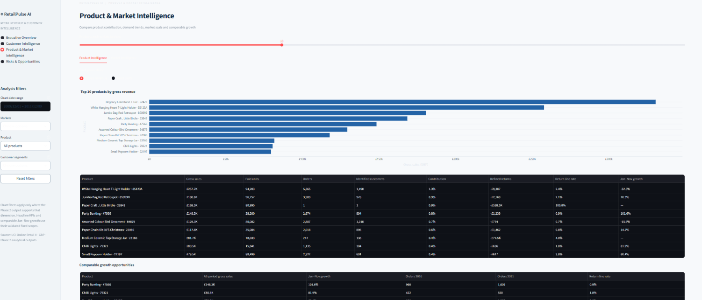
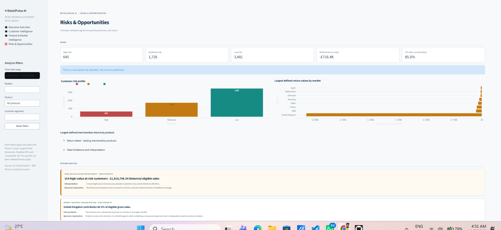

# RetailPulse AI — Retail Revenue & Customer Intelligence System

## Overview

RetailPulse AI is a local Python analytics pipeline and four-page Streamlit dashboard created for the AICTE | IBM SkillsBuild Data Analytics with AI Internship 2026 student project. It transforms historical retail transactions into validated merchandise KPIs, trends, product and market findings, descriptive customer segments, rule-based risk indicators, and evidence-based opportunities.

## Business problem

A retail business has a large volume of historical transaction data but needs a unified intelligence system to understand revenue performance, customer value and inactivity, product and market performance, risks, and opportunities. The project makes the path from descriptive metrics to management review and action visible.

## Business objectives

- Measure sales, orders, customers, units, and returns with explicit definitions.
- Understand comparable revenue and order trends.
- Identify important products, markets, and revenue concentration.
- Segment identified customers through RFM behavior.
- Prioritize valuable customers for review using transparent rules.
- Surface supported product and market opportunities and recommended actions.
- Present evidence through an interactive decision-support dashboard.

## Key features

- Reads workbook sheets sequentially to limit memory use.
- Audits exact duplicate rows and documents transaction classification.
- Validates and writes compact Parquet/JSON analytical outputs.
- Provides interactive charts, filters, product/customer tables, risk signals, opportunities, and recommendations.
- Uses anonymous customer keys in customer analysis views.

## Dashboard pages

1. **Executive Overview** — merchandise gross/net sales, orders, customers, AOV, revenue and order trends, leading products and markets, key findings.
2. **Customer Intelligence** — four RFM/K-Means segments, customer value and recency profiles, risk profile, prioritized anonymous customer table.
3. **Product & Market Intelligence** — product contribution, comparable growth and return behavior; market revenue, customer contribution and trends.
4. **Risks & Opportunities** — rule-based risk levels, returns, opportunity evidence, and prioritized actions.

## Dataset source

The dataset is **UCI Online Retail II**, dataset 502 (not Kaggle):

https://archive.ics.uci.edu/dataset/502/online%2Bretail%2Bii

Download `online_retail_II.xlsx` from the official UCI page and place it inside `data/` as:

```text
data/online_retail_II.xlsx
```

The workbook is approximately 43.5 MB and has two overlapping sheets. `analysis.py` reads one sheet at a time, combines records by actual invoice dates, and removes exact repeated rows only from analytical aggregates. It does not modify the workbook. Do not use an unofficial mirror.

## Data pipeline

```text
UCI Online Retail II workbook
  → sequential sheet inspection and transaction classification
  → exact-row deduplication and validation
  → compact KPI, time-series, product, market, return, and customer tables
  → RFM and K-Means behavioral segments
  → rule-based risk and opportunity engine
  → Streamlit dashboard
  → management review and action
```

The repository includes the compact Parquet/JSON files in `data/processed/`. The dashboard reads these committed outputs directly, so you can run it without downloading or reprocessing the original workbook. After downloading the official UCI workbook, you can run `analysis.py` to regenerate or update the processed outputs; the script reads one sheet at a time and does not modify the workbook.

## KPI definitions

- **Gross Sales:** sum of `Quantity × Price` for eligible numeric-invoice, non-C-prefixed, positive-quantity, positive-price merchandise sale lines after exact-row deduplication. Services, vouchers, and adjustments are excluded.
- **Return/cancellation value:** signed sum of C-prefixed, negative-quantity, positive-price merchandise lines after deduplication.
- **Net Sales:** Gross Sales plus the signed defined merchandise return value. Service reversals are separate.
- **Orders:** distinct invoices with at least one eligible merchandise sale line.
- **Identified Customers:** distinct nonmissing Customer IDs on eligible sale orders.
- **Paid Units:** eligible positive-quantity and positive-price merchandise units; zero-price units are separate.
- **AOV:** Gross Sales divided by eligible distinct orders.
- **Repeat Customer Rate:** identified customers with more than one distinct eligible order divided by identified eligible-sale customers.
- **Return Line Rate:** defined merchandise return lines divided by ordinary merchandise sale lines.
- **Comparable Growth:** Jan–Nov 2011 Gross Sales divided by Jan–Nov 2010 Gross Sales, minus one. December is omitted because 2011 ends on December 9.

Validated baseline: Gross Sales **£19,640,817.62**; Net Sales **£18,924,423.25**; **39,516** orders; **5,852** identified customers; AOV **£497.03**; repeat customer rate **72.35%**; comparable growth **+2.98%**. These are full-period KPI values; chart filters do not change them.

## RFM methodology

RFM uses identified customers and eligible merchandise sales. **Recency** is days since last eligible purchase, with reference date **2011-12-10**. **Frequency** is distinct eligible orders. **Monetary** is eligible gross merchandise sales. Customer features are log transformed and standardized for clustering. Missing-ID transactions remain in business-wide metrics but are excluded from customer-level analysis.

## K-Means segmentation

K-Means candidates K=2 through K=6 were assessed using sampled silhouette and adjusted Rand seed stability. K=4 was selected for useful profile separation and stability (silhouette **0.366**, ARI **0.997**), although K=2 had the highest silhouette. The segments are **Low-Value Inactive**, **Recent Developing**, **Valuable At Risk**, and **High-Value Active**. These are unsupervised descriptions of observed behavior, not predictions.

## Customer Risk Indicator

This is a transparent rule-based score: 50% recency percentile + 30% six-month spending decline + 20% defined return-value ratio. Recent spend is Jun–Nov 2011; comparison spend is Dec 2010–May 2011. Bands are Low (≤50), Moderate (>50–75), and High (>75). High-value at-risk prioritization also requires top-quartile monetary value and score ≥60.

**This is a rule-based risk indicator, not a churn prediction.** The current rule identifies **154** high-value at-risk customers with **£1,018,708.34** in historical eligible sales.

## Opportunity engine

The implemented rules include top-quartile customers meeting the at-risk threshold, markets with at least 100 orders in both Jan–Nov comparison windows and positive growth, and products with at least 20 orders in both periods and at least 20% growth. The engine flags market concentration as context. Recommendations include tailored retention tests and validation of market capacity, stock, margin, return rates, and repeat behavior before investment.

## Technology stack

Python, pandas, NumPy, openpyxl, scikit-learn, PyArrow, Streamlit, Plotly, and python-docx. All dependencies are pinned in `requirements.txt`. pandas is pinned to **2.3.3**, the compatible version selected for Streamlit 1.54.0. `python-docx` is used by `generate_report.py` to recreate the report from the processed outputs and existing screenshots.

## Project structure

```text
retailpulse-ai/
├── analysis.py
├── app.py
├── generate_report.py
├── PROJECT_PLAN.md
├── PROJECT_REPORT.docx
├── README.md
├── requirements.txt
├── assets/screenshots/
│   ├── 01_executive_overview.png
│   ├── 02_customer_intelligence.png
│   ├── 03_product_market.png
│   └── 04_risks_opportunities.png
└── data/
    ├── online_retail_II.xlsx  # downloaded separately; ignored by Git
    └── processed/             # compact analytical outputs committed to the repository
```

## Installation and virtual environment

Windows PowerShell:

```powershell
py -3.13 -m venv .venv
.\.venv\Scripts\Activate.ps1
python -m pip install --upgrade pip
python -m pip install -r requirements.txt
```

## Generate outputs and run the dashboard

To run the dashboard using the committed processed outputs:

```powershell
streamlit run app.py
```

The dashboard runs locally and reads the committed `data/processed/` outputs. The original raw workbook, `data/online_retail_II.xlsx`, is excluded from Git by `.gitignore`.

To regenerate or update the processed outputs, download the official UCI workbook and place it at `data/online_retail_II.xlsx`, then run:

```powershell
python analysis.py
```

After the analytical outputs and screenshots are available, regenerate the Word report with:

```powershell
python generate_report.py
```

This writes `PROJECT_REPORT.docx` in the project root. It reads validated files under `data/processed/` and inserts the four existing screenshots; it does not rerun or modify analytical logic.

## Screenshots

### Executive Overview


### Customer Intelligence


### Product & Market Intelligence


### Risks & Opportunities


## Key findings

- Comparable Jan–Nov merchandise sales grew **2.98%**.
- The UK accounts for **85.5%** of eligible merchandise sales. This is concentration exposure to monitor, not evidence that the market is inherently undesirable.
- The **Valuable At Risk** segment contains **1,448** customers.
- **154** high-value at-risk customers represent **£1,018,708.34** in historical eligible sales.
- France is a qualifying growth market at **40.3%**, with 203 / 345 orders in the respective comparison periods.
- Exact duplicate treatment removes **34,335** repeated occurrences and reduces eligible gross sales by **£466,309.43**. This material assumption is documented.

## Limitations

- **243,007** source rows have no Customer ID; customer analysis covers identified transactions representing **86.89%** of eligible merchandise revenue.
- Historical data may not represent current conditions and does not establish causation.
- The Customer Risk Indicator is not churn prediction; K-Means clusters are not forecasts.
- Duplicate decisions materially affect gross sales; unpriced negative-quantity rows cannot be assigned a monetary return amount.
- No margin, campaign exposure, or verified churn outcome labels are available. Opportunity values are historical sales, not predicted uplift.

## Future scope

Potential extensions include real-time ingestion, forecasting, automated alerts, additional customer features, cloud deployment, database-backed architecture, and a natural-language analytics assistant. These are not implemented in this version.

## References

1. Chen, D. (2012). [Online Retail II, UCI Machine Learning Repository](https://archive.ics.uci.edu/dataset/502/online%2Bretail%2Bii). DOI: [10.24432/C5CG6D](https://doi.org/10.24432/C5CG6D).
2. [Streamlit documentation](https://docs.streamlit.io/).
3. [scikit-learn documentation](https://scikit-learn.org/stable/).
4. [Plotly Python documentation](https://plotly.com/python/).
5. [pandas documentation](https://pandas.pydata.org/docs/).
